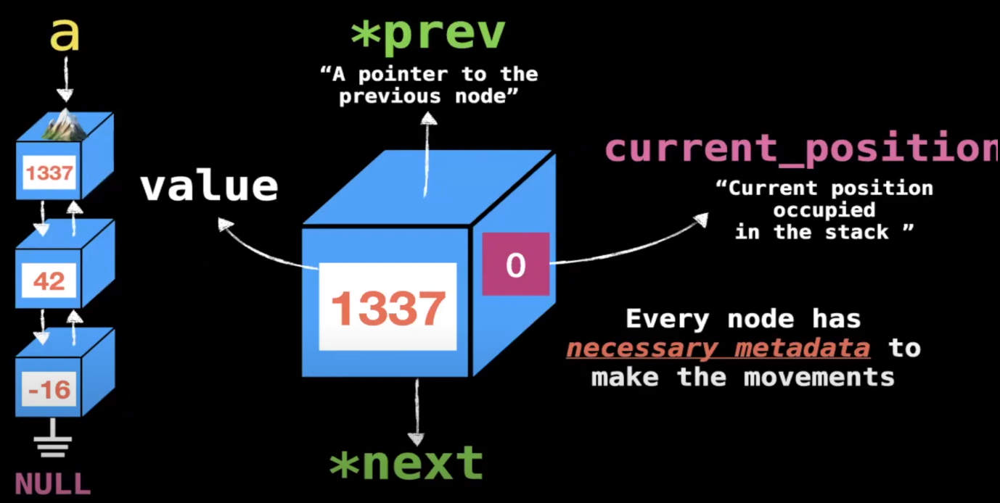

## [Linked list](https://www.youtube.com/playlist?)
[](./linked_list.png)

## Simple linked list

### 1. ***Short introduction to linked lists***
```c
// This used for all examples below.

// You need this includes to use malloc, free, NULL, exit and printf.
#include <stdio.h>
#include <stdlib.h>
#include <string.h>

// Create a node that contains an integer and a pointer to the next node.
typedef struct Node {
    int x;
    struct Node* next;
} Node;
```
```c
int main(int argc, char* argv[]) {
	// Create a node called root.
    Node root;
	// Assign a value to the node.
    root.x = 15;
	// Create a pointer to the next node and memory allocation.
    root.next = malloc(sizeof(Node));
	// Assign a value to the next node.
    root.next->x = -2;
	// Create a pointer to the next node and set it to NULL.
    root.next->next = NULL;

    printf("First: %d\n", root.x); // output: 15
    printf("Second: %d\n", root.next->x); // output: -2
    return 0;
}
```

### 2. ***Iterating over a linked list***
ARRAYS | LINKED LISTS
:-----:|:------------:
int i = 0; | Node* curr = &root;
i < n; | curr != NULL;
i++; | curr = curr->next;

```c
int main(int argc, char* argv[]) {
    Node root;
    root.x = 15;
    root.next = malloc(sizeof(Node));
    root.next->x = -2;
    root.next->next = malloc(sizeof(Node));
    root.next->next->x = 22
    root.next->next->next = NULL;

	// Iterate over the linked list with a while loop.
	Node* curr = &root;
	while (curr != NULL) {
		printf("%d\n", curr->x);
		curr = curr->next;
	}

	// Iterate over the linked list with a for loop.
    for (Node* curr = &root; curr != NULL; curr = curr->next) {
        printf("%d\n", curr->x);
    }

	// You need free this memory first before you can free the root.next.
    free(root.next->next);
    free(root.next);

    return 0;
}
```

### 3. ***Adding elements to the end of a linked list***
```c
// Node** root is a pointer to a pointer to a node.
void insert_end(Node** root, int value) {
	// Create a new node and memory allocation.
    Node* new_node = malloc(sizeof(Node));
    if (new_node == NULL)
        exit(1); // Exit the program if malloc fails.
	// Set the next node to NULL.
    new_node->next = NULL;
	// Assign a value to the new node.
    new_node->x = value;

	// If the root is NULL, set the root to the new node.
    if (*root == NULL) {
        *root = new_node;
        return;
    }

	// Iterate over the linked list until the last node.
    Node* curr = *root;
    while (curr->next != NULL) {
        curr = curr->next;
    }
    curr->next = new_node;
}

int main(int argc, char* argv[]) {
	// Create a pointer to a node and set it to NULL.
    Node* root = NULL;

	// Initialize the linked list with a value.
	// Node* root = malloc(sizeof(Node));
	// if (root == NULL)
	// 	exit(2); // Exit the program if malloc fails.
	// root->next = NULL;
	// root->x = 15;

	// Add elements to the end of the linked list.
    insert_end(&root, -2);
    insert_end(&root, 11);
    insert_end(&root, 22);

	// Iterate over the linked list with a while loop.
	Node* curr = root;
	while (curr != NULL) {
		printf("%d\n", curr->x);
		curr = curr->next;
	}

    // List is not freed!

    return 0;
}
```

### 4. ***Deallocating a linked list***
```c
// deallocates the linked list
// Node** root is a pointer to a pointer to a node.
void deallocate(Node** root) {
	// Atribute the root to a Node* curr.
    Node* curr = *root;
    while (curr != NULL) {
		// Atribute the curr to a Node* aux.
        Node* aux = curr;
		// Atribute the next node to curr.
        curr = curr->next;
		// Free the aux node.
        free(aux);
    }
	// At the end you need set the root to NULL.
    *root = NULL;
}

int main(int argc, char* argv[]) {
    Node* root = NULL;

    insert_end(&root, -2);
    insert_end(&root, 11);
    insert_end(&root, 22);

    // Iterate over the linked list with a while loop.
	Node* curr = root;
	while (curr != NULL) {
		printf("%d\n", curr->x);
		curr = curr->next;
	}

	// Function to deallocate the linked list.
    deallocate(&root);

    return 0;
}
```
### 5 ***Adding elements to the beginning of a linked list***
```c
void insert_beginning(Node** root, int value) {
    Node* new_node = malloc(sizeof(Node));
    if (new_node == NULL)
        exit(3);

	// Atribute the value to the new node.
    new_node->x = value;
	// Atribute the root to the next node.
    new_node->next = *root;

	// Atribute the new node to the root.
    *root = new_node;
}

int main(int argc, char* argv[]) {
    Node* root = NULL;

    insert_end(&root, -2);
    insert_end(&root, 11);
    insert_end(&root, 22);
    insert_beginning(&root, 50);
    insert_beginning(&root, 17);

    // Iterate over the linked list with a while loop.
	Node* curr = root;
	while (curr != NULL) {
		printf("%d\n", curr->x);
		curr = curr->next;
	}

	// Function to deallocate the linked list.
    deallocate(&root);

    return 0;
}
```

### 6. ***Add after element in a linked list***
```c
void insert_after(Node* node, int value) {
	Node* new_node = malloc(sizeof(Node));
	if (new_node == NULL)
		exit(4);

	// Atribute the value to the new node.
	new_node->x = value;
	// Atribute the next node to the new node.
	new_node->next = node->next;
	// Atribute the new node to the next node of the node.
	node->next = new_node;
}

int main(int argc, char* argv[]) {
    Node* root = NULL;

    insert_end(&root, -2); // root
    insert_end(&root, 11); // root->next
    insert_end(&root, 22); // root->next->next
    insert_beginning(&root, 30); // root
    insert_after(root->next, 55); // root->next->next

	Node* curr = root;
	while (curr != NULL) {
		printf("%d\n", curr->x); // output: 30, -2, 55, 11, 22
		curr = curr->next;
	}

    deallocate(&root);

    return 0;
}
```

### 7. ***Sorted insert in a linked list***
```c
void insert_sorted(Node** root, int value) {
    // If the root is NULL or the value is smaller than the root value, insert at the beginning.
    // (**root).x is the same as (*root)->x
    if (*root == NULL || (**root).x >= value) {
        insert_beginning(root, value);
        return;
    }

    Node* curr = *root;
    while (curr->next != NULL) {
        if (curr->next->x >= value) {
            insert_after(curr, value);
            return;
        }
        curr = curr->next;
    }

    insert_after(curr, value);
}

int main(int argc, char* argv[]) {
    Node* root = NULL;

    insert_sorted(&root, 11);
    insert_sorted(&root, 55);
    insert_sorted(&root, -2);
    insert_sorted(&root, 22);
    insert_sorted(&root, 30);

    Node* curr = root;
	while (curr != NULL) {
		printf("%d\n", curr->x);
		curr = curr->next;
	}

    deallocate(&root);

    return 0;
}
```

### 8. ***Removing an element from a linked list***
```c
void    remove_element(Node **root, int value)
{
    if (*root == NULL)
        return ;

    // for removing the first element
    if ((*root)->x == value)
    {
        Node *to_remove = *root;
        *root = (*root)->next;
        free(to_remove);
        return ;
    }

    Node *curr = *root;
    while (curr != NULL && curr->next != NULL)
    {
        if (curr->next->x == value)
        {
            Node *to_remove = curr->next;
            curr->next = curr->next->next;
            free(to_remove);
            return ;
        }
        curr = curr->next;
    }
}

int main(int argc, char* argv[]) {
    Node* root = NULL;

    insert_sorted(&root, 1);
    insert_sorted(&root, 3);
    insert_sorted(&root, 5);
    insert_sorted(&root, 6);

    remove_element(&root, 6);

    Node* curr = root;
	while (curr != NULL) {
		printf("%d\n", curr->x);
		curr = curr->next;
	}

    deallocate(&root);

    return 0;
}
```

### 9. ***Reversing a linked list***

1 | 3 | 6
:-----:|:-----:|:-----:
prev | curr | next

```c
// Treta para entender o reverse mais funciona lindamente
void  reverse(Node **root)
{
    Node *prev = NULL;
    Node *curr = *root;

    while (curr != NULL)
    {
        Node *next = curr->next;
        curr->next = prev;
        prev = curr;
        curr = next;
    }
    *root = prev;
}

int main(int argc, char* argv[]) {
    Node* root = NULL;

    insert_end(&root, 1);
    insert_end(&root, 3);
    insert_end(&root, 6);

    reverse(&root);

    Node* curr = root;
	while (curr != NULL) {
		printf("%d\n", curr->x);
		curr = curr->next;
	}

    deallocate(&root);

    return 0;
}
```

### 10. ***Finding loops/cycles in a linked list***
```c
void has_loops(Node* root) {
    Node* slow = NULL;
    Node* fast = NULL;

    while (slow != NULL && fast != NULL && fast->next != NULL) {
        slow = slow->next;
        fast = fast->next->next;

        if (slow == fast) {
            return 1;
        }
    }
    return 0;
}

int main(int argc, char* argv[]) {
    Node* root = NULL;

    insert_sorted(&root, 11);
    insert_sorted(&root, 55);
    insert_sorted(&root, -2);
    insert_sorted(&root, 22);
    insert_sorted(&root, 30);

    reverse(&root);

    if (has_loops(root)) {
        printf("List has loops\n");
    } else {
        // Iterate only if doesn't have loops
        for (Node* curr = root; curr != NULL; curr = curr->next) {
            printf("%d\n", curr->x);
        }
    }

    deallocate(&root);

    return 0;
}
```

### 11. ***Counting number of elements (iteratively and recursively) in a linked list***
```c
int count(Node *root)
{
    int c = 0;

    Node *curr = root;
    while (curr != NULL)
    {
        curr = curr->next;
        c++;
    }
    return (c);
}

int count_recursive(Node *node)
{
    if (node == NULL)
        return 0;
    return (1 + count_recursive(node->next));
}

int main(int argc, char* argv[]) {
    Node* root = NULL;

    insert_end(&root, 1);
    insert_end(&root, 2);
    insert_end(&root, 3);
    insert_end(&root, 4);
    insert_end(&root, 5);
    insert_end(&root, 6);
    insert_end(&root, 7);
    insert_end(&root, 8);

    Node* curr = root;
	while (curr != NULL) {
		printf("%d\n", curr->x);
		curr = curr->next;
	}

    // printf("Linked list has %d elements\n", count(root));
    printf("Linked list has %d elements\n", count_recursive(root));

    deallocate(&root);

    return 0;
}
```

